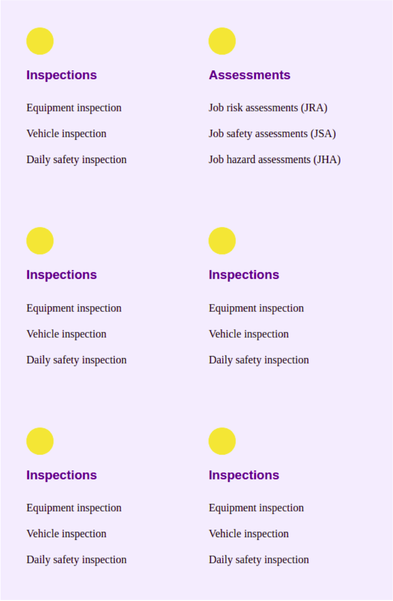
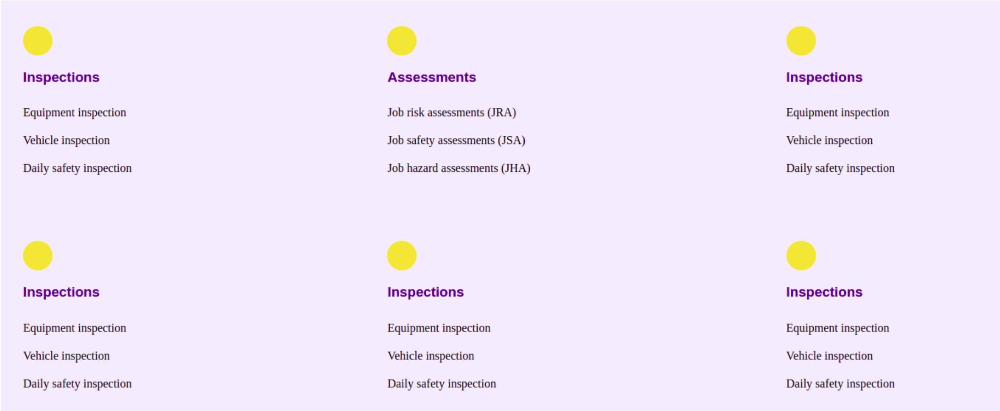

# Responsive Workshops (optional)

## Exercise 1

Use the provided HTML and CSS in the above repository.

The HTML is missing an HTML element to import the CSS. Add it.

The mobile version of the website has already been written. Your job is to add a media query for the desktop version.

### Mobile version (already done)

### Desktop version

