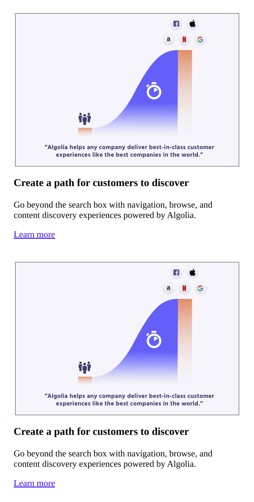
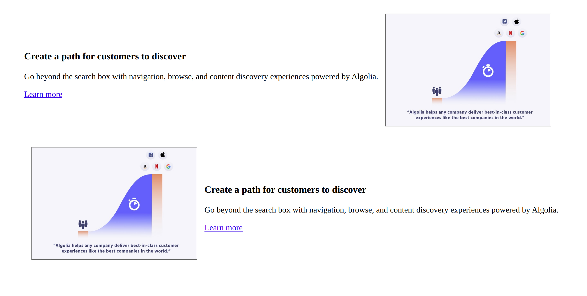

# Responsive Workshops (optional)

## Exercise 5

The HTML has already been provided (see above repository), but you need to write the CSS to match the images below.

(Hint: reverse-wrap could come in handy  https://www.w3schools.com/cssref/css3_pr_flex-wrap.asp)

### Mobile version

### Desktop version

